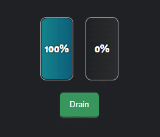

# drain-js

[](https://www.npmjs.com/package/drain-js)
[](https://opensource.org/licenses/MIT)



A callback based utility for making fluent number changes.

## Install

```sh
npm install drain-js
```

```sh
yarn add drain-js
```

## Usage

```js
import drain from 'drain-js';

drain({ start: 3000, end: 2750, onInterval: console.log });

// Output
2906
2812
2803
...
2752
2751
2750
```


### Parameters

```ts
drain({
  start: Number,
  end: Number,
  speed: Number,
  onInterval: Function,
  onComplete: Function,
});
```

| Name       | Default   | Description                                                                                                  |
| ---------- | --------- | ------------------------------------------------------------------------------------------------------------ |
| speed      | 100       | An animation can be completed in about 10 to 20 steps. The `speed` (ms) value is the time set for each step. |
| start      | undefined | The value at which the animation will start                                                                  |
| end        | undefined | The value at which the animation will end.                                                                   |
| onInterval | undefined | The function that will run at each step until the animation is complete.                                     |
| onComplete | undefined | The function to run when the animation is complete.                                                          |

### Demo List

| Name             | Status | URL                                                                          |
| ---------------- | ------ | ---------------------------------------------------------------------------- |
| Demo             | ✔️     | [Link](https://codepen.io/aykutkardas/pen/QWMaeqw?editors=1010)              |
| Demo with React  | ✔️     | [Link](https://codesandbox.io/s/drain-js-react-demo-crzyu)                   |
| Demo with Vue    | ✔️     | [Link](https://codesandbox.io/s/drain-js-vue-demo-pisdm?file=/src/App.vue)   |
| Demo with Svelte | ✔️     | [Link](https://codesandbox.io/s/drain-js-svelte-demo-i2m3e?file=/App.svelte) |
